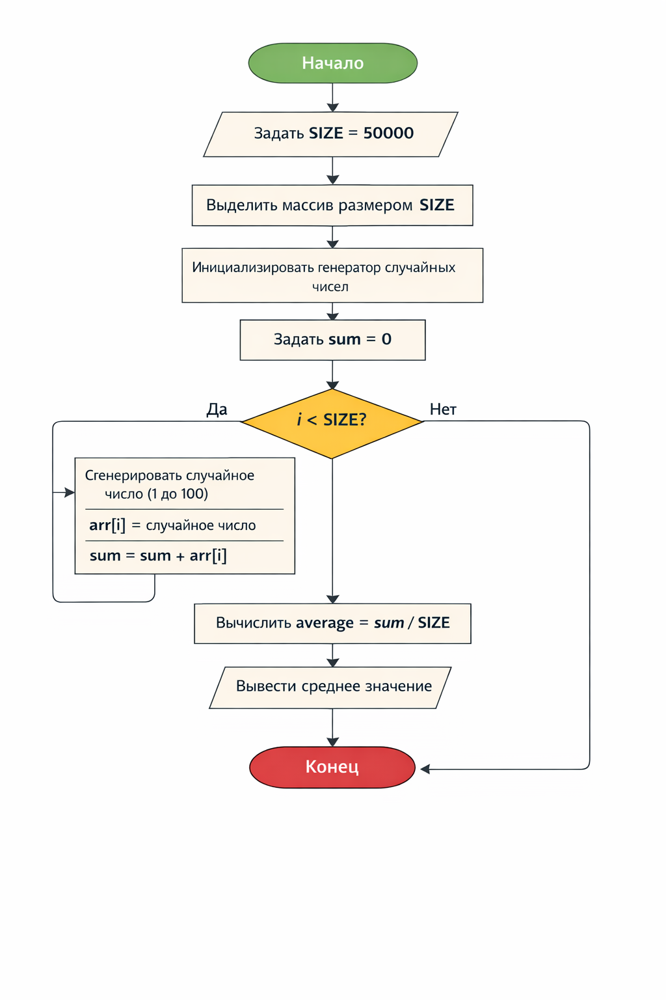
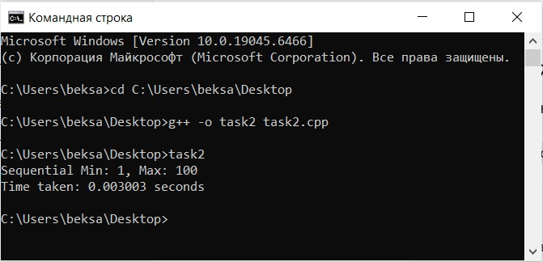
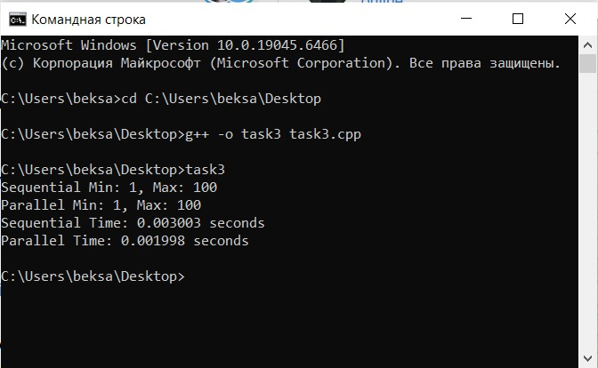
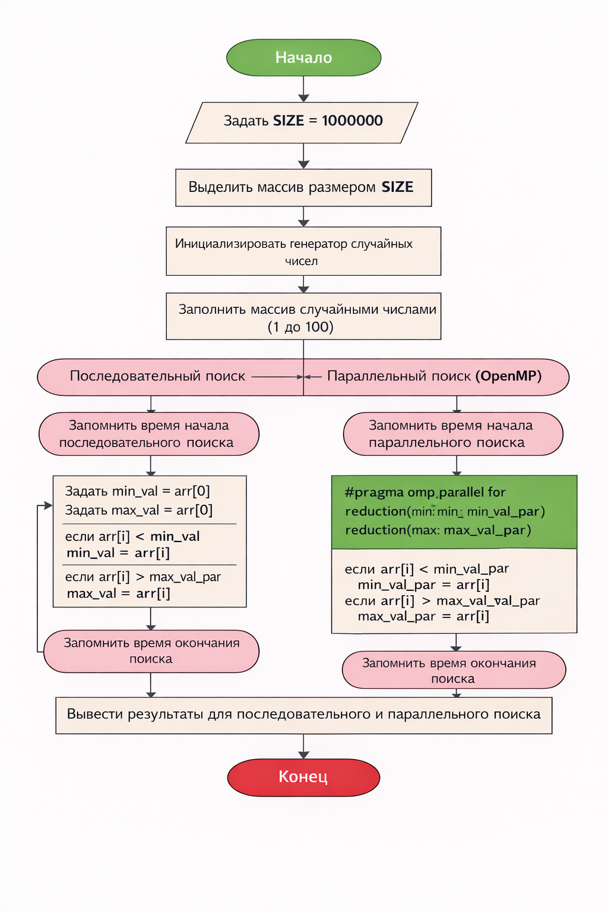
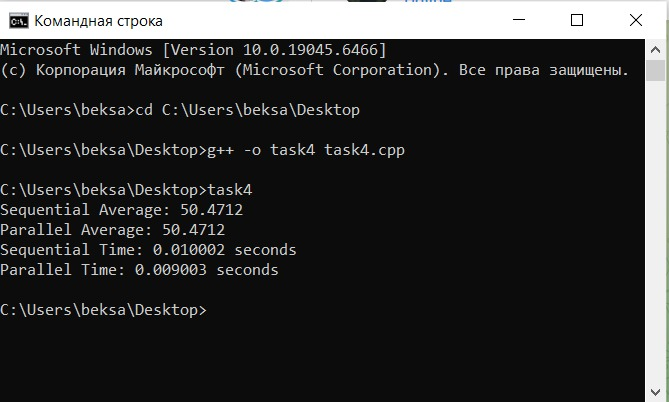

# Assignment 1

## Задание 1: Динамическое выделение памяти и вычисление среднего значения

В этом задании создается динамический массив размером 50 000 элементов, который заполняется случайными числами от 1 до 100. Затем вычисляется среднее значение всех элементов массива. Для этого используется оператор `new` для выделения памяти, а оператор `delete[]` — для освобождения памяти после использования. Сначала массив заполняется случайными числами с помощью функции `rand()`, и затем рассчитывается среднее значение элементов массива путем деления суммы всех элементов на количество элементов.

## Задание 2: Последовательный поиск минимального и максимального элемента в массиве

В этом задании создается массив из 1 000 000 целых чисел. Для поиска минимального и максимального значений в массиве используется обычный цикл, в котором на каждом шаге проверяется, является ли текущий элемент массива меньшим или большим по сравнению с текущими значениями минимального и максимального элементов. Это позволяет за один проход по массиву найти оба значения. Также замеряется время выполнения этого алгоритма с помощью библиотеки `<chrono>`.

## Задание 3: Параллельный поиск минимального и максимального элемента в массиве с использованием OpenMP

В этом задании реализуется параллельный поиск минимального и максимального элементов массива с использованием OpenMP. Для этого используется директива `#pragma omp parallel for`, которая позволяет распараллелить цикл и выполнять его итерации одновременно в нескольких потоках. Это значительно ускоряет выполнение алгоритма, особенно на многопроцессорных системах. Чтобы избежать ошибок при одновременном доступе разных потоков к общим данным, используется директива `#pragma omp critical`, которая синхронизирует доступ к переменным, хранящим минимальное и максимальное значения.

## Задание 4: Вычисление среднего значения элементов массива с использованием OpenMP

В этом задании создается массив из 5 000 000 чисел. Сначала вычисляется среднее значение элементов массива с использованием обычного последовательного подхода, а затем с использованием OpenMP с редукцией. При использовании OpenMP для вычисления среднего значения, каждый поток работает с локальной копией переменной суммы, и только в конце все локальные значения суммируются в одну итоговую переменную. Это позволяет ускорить вычисление, деля работу между несколькими потоками.

## Контрольные вопросы

1. **В чём отличие динамического массива от статического массива в языке C++?**  
   Динамический массив в C++ создается во время выполнения программы с помощью оператора `new`. Его размер можно изменять в процессе работы программы. В отличие от этого, статический массив имеет фиксированный размер, который задается при его создании, и его размер не может быть изменён.

2. **Что такое указатель и зачем он используется при работе с динамической памятью?**  
   Указатель — это переменная, которая хранит адрес другой переменной. В контексте динамической памяти указатели используются для хранения адресов динамически выделенных блоков памяти, что позволяет эффективно управлять памятью во время выполнения программы.

3. **Почему важно корректно освобождать память после использования динамических массивов?**  
   Когда память выделяется с помощью оператора `new`, она не освобождается автоматически, и если не использовать `delete[]` для освобождения памяти, это приведет к утечке памяти. Утечка памяти может привести к избыточному использованию ресурсов, что может замедлить работу программы или даже вызвать её сбой.

4. **В чём разница между последовательной и параллельной обработкой массива?**  
   Последовательная обработка массива подразумевает выполнение операций поочередно, одна за другой, с использованием одного потока процессора. В параллельной обработке несколько потоков выполняют части работы одновременно, что значительно ускоряет выполнение задачи, особенно для больших массивов данных.

5. **Что делает директива `#pragma omp parallel for`?**  
   Директива `#pragma omp parallel for` сообщает компилятору, что цикл должен быть распараллелен, и его итерации могут быть выполнены одновременно разными потоками. Это позволяет значительно ускорить выполнение цикла, особенно на многозадачных системах.

6. **Для чего используется механизм `reduction` в OpenMP?**  
   Механизм `reduction` в OpenMP используется для безопасного выполнения операций с переменными, которые могут быть изменены несколькими потоками. Он позволяет каждому потоку работать с локальной копией переменной и в конце объединяет результаты в одну общую переменную.

7. **Почему при параллельном вычислении суммы необходимо использовать `reduction`, а не обычную переменную?**  
   При параллельном вычислении суммы несколько потоков могут одновременно изменять одну и ту же переменную, что приведет к ошибкам из-за **конкурентного доступа**. Использование `reduction` предотвращает это, так как каждый поток работает с собственной локальной копией переменной, а затем результаты объединяются корректно.

8. **Какие факторы могут привести к тому, что параллельная версия программы будет работать медленнее последовательной?**  
   Параллельная версия программы может работать медленнее последовательной, если накладные расходы на создание и управление потоками превышают выгоды от параллельного выполнения. Также если задачи, которые выполняются в параллельных потоках, слишком малы или плохо разделяются, параллельная обработка может не дать ускорения. Другие факторы — это проблемы с синхронизацией потоков, конкуренция за ресурсы и плохое распределение работы между потоками.

---

